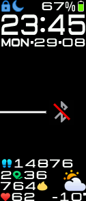

# MiBand5-watchface_for_xDrip
My custom version of the MiBand5-watchface for xDrip+
 
 
 
First of all:  
Thanks to [Artem](https://github.com/bigdigital) who created such a great solution for use with a MiBand.  
It's even better now with the new created [WatchDrip+ App](https://bigdigital.home.blog/2022/06/16/watchdrip-a-new-application-for-xdrip-watch-integration/).  
This makes it possible to use the original xDrip+ App which results in an easier update process.  
  
The steps, temperature and battery appeared too small to read for me and I also missed the heartrate.  
So I decided to create a customized version of the original watchface.  
  
• changed the font and enlarged the smaller one  
• moved weather icon and temperature to bottom right and removed other parts  
• moved battery to top right, added % sign and changed icon
• moved weekday and date below time
• moved up steps a bit and changed icon  
• added distance below with numbers and icon as separator  
• added calories below with numbers and icon  
• added heartrate below with icon and numbers  
  
This is how it looks:  
   
  
And here is a comparizon between the original (left) and my custom version (right):  
  
  
To change the original watchface you need to copy the files  
[my_image.png](my_image.png) and [my_watchface.bin](my_watchface.bin) into the XDRIP folder on your phone  
and then either activate MiBand use in your [altered xDrip+ App](https://bigdigital.home.blog/2020/08/25/new-xdrip-now-supports-miband-5/) or inside [WatchDrip+](https://bigdigital.home.blog/2022/06/16/watchdrip-a-new-application-for-xdrip-watch-integration/) if you use that.  
  
I hope you like my version of the watchface.  
  
Greetings,  
A-Jey :-)
